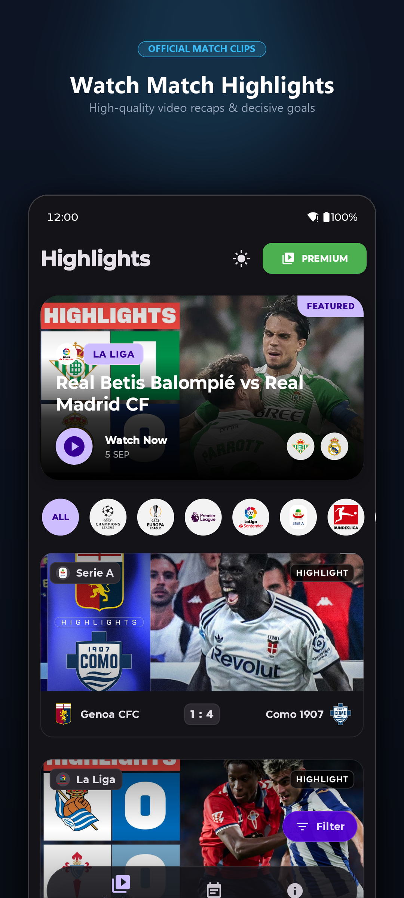
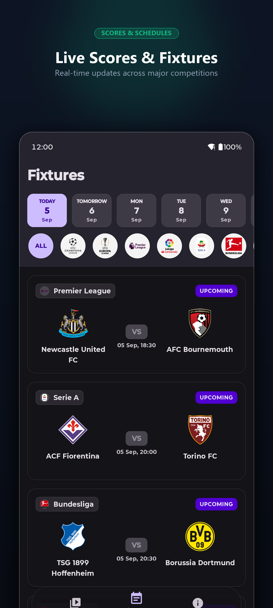
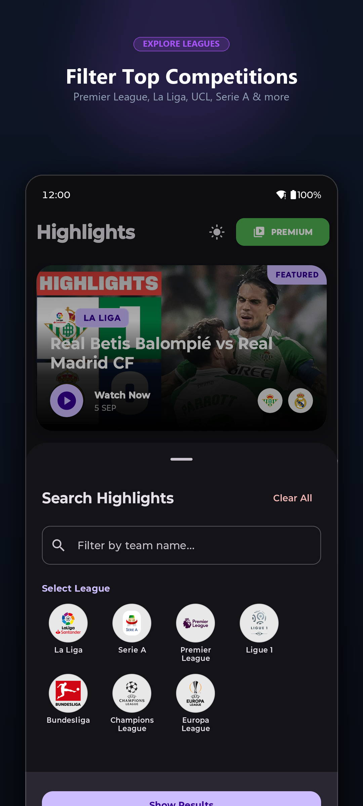
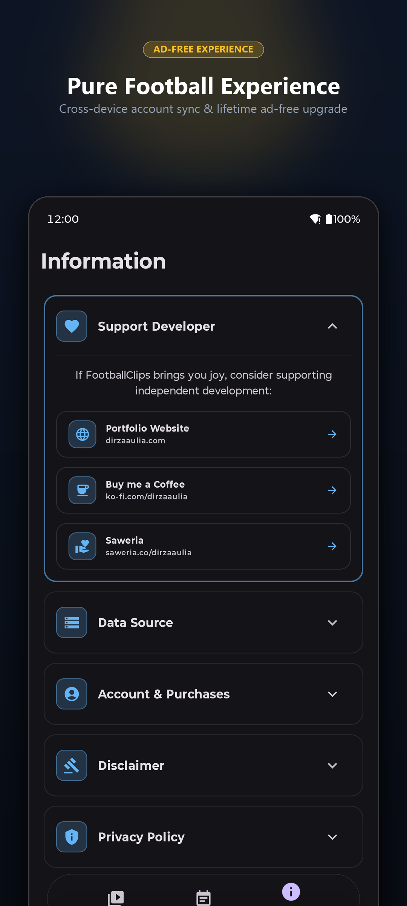
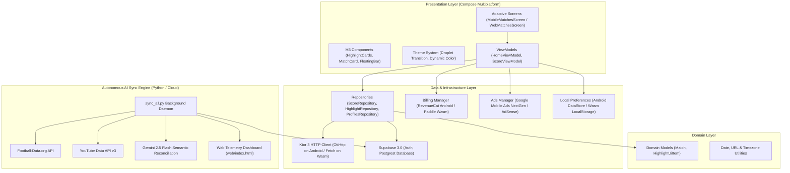

# ⚽ Football Clips (Compose Multiplatform)

<div align="center">


### Watch Official Match Highlights & Follow Real-Time World Football Scores

[](https://kotlinlang.org)
[](https://www.jetbrains.com/lp/compose-multiplatform/)
[](https://developer.android.com)
[](https://fc.dirzaaulia.com)
[](https://supabase.com)
[](https://play.google.com/store/apps/details?id=com.dirzaaulia.footballclips)

</div>

---

## 📱 Google Play Store Marketing Showcase

Here are the official high-resolution marketing banners featured on the Google Play Store listing:

<div align="center">
  <table>
    <tr>
      <td align="center" width="25%">
        
        <br />
        <b>🎬 Watch Match Highlights</b>
        <br />
        <sub>High-quality video recaps & decisive goals</sub>
      </td>
      <td align="center" width="25%">
        
        <br />
        <b>⚡ Live Scores & Fixtures</b>
        <br />
        <sub>Real-time updates across top leagues</sub>
      </td>
      <td align="center" width="25%">
        
        <br />
        <b>🏆 Filter Top Competitions</b>
        <br />
        <sub>Premier League, La Liga, UCL, Serie A & more</sub>
      </td>
      <td align="center" width="25%">
        
        <br />
        <b>💎 Pure Football Experience</b>
        <br />
        <sub>Cross-device account sync & lifetime ad-free</sub>
      </td>
    </tr>
  </table>
</div>

---

## ✨ Key Features

- 🎥 **HD Official Match Highlights**: Curated, decisive goals, and extended match highlights from official club channels and authorized broadcast partners.
- ⚡ **Live Scores & Real-Time Fixtures**: Live scoreboards with interactive status indicators (`LIVE`, `FINISHED`, `SCHEDULED`), team crests, and kickoff schedules.
- 🧭 **Quick League & Date Filtering**: Single-tap competition quick-filter pills (Premier League, La Liga, UEFA Champions League, Serie A, Bundesliga, Ligue 1, etc.) and custom date selector bar.
- 🎨 **Material 3 Expressive Design**: 
  - Dynamic edge-to-edge layout on Android (Target SDK 36).
  - Signature Droplet circular-reveal dark/light theme switching animation.
  - Floating pill navigation bar with dynamic badge indicators.
- 🌐 **Responsive Multiplatform UI**: 
  - **Android**: Native app with hardware acceleration and inline/fullscreen YouTube playback.
  - **Web (Kotlin/Wasm)**: High-performance desktop and mobile web dashboard compiled directly to WebAssembly (`fc.dirzaaulia.com`).
- 💎 **Universal Account & In-App Purchase Sync**:
  - Google Native Sign-In via Supabase Auth.
  - Google Play In-App Billing (RevenueCat SDK) for Android.
  - Web checkout integration (Paddle).
  - Cross-device entitlement synchronization stored securely in Supabase PostgreSQL (`profiles` table).

---

## 🏛️ System Architecture

The application adopts **Clean Architecture** combined with **MVI / MVVM** reactive patterns:



---

## 🛠️ Modern Tech Stack

| Category | Technology | Description |
|---|---|---|
| **Language** | **Kotlin 2.0.21** | Kotlin Multiplatform with modern compiler features |
| **UI Framework** | **Compose Multiplatform 1.7.0** | Declarative UI for Android & Web (WASM) |
| **Design System** | **Material 3 Expressive** | Edge-to-edge, dynamic color schemes, custom animations |
| **Target Platform** | **Android 16 / SDK 36** | Min SDK 29, compile & target SDK 36 |
| **Web Target** | **Kotlin/Wasm (WebAssembly)** | Browser client served via Firebase Hosting |
| **Architecture** | **Clean Architecture + MVVM** | Reactive flows (`StateFlow`, `SharedFlow`, Coroutines 1.9.0) |
| **Dependency Injection** | **Koin 4.0.0** | `koin-core`, `koin-compose`, `koin-compose-viewmodel` |
| **Networking** | **Ktor 3.0.1** | `ktor-client-core`, `ktor-client-okhttp`, `ktor-client-js` |
| **JSON Serialization** | **kotlinx.serialization 1.7.3** | High-performance JSON parser |
| **Image Loading** | **Coil 3.0.0-rc01** | `coil-compose`, `coil-network-ktor3`, `coil-svg` |
| **Backend & Auth** | **Supabase 3.0.0** | `supabase-kt` Postgrest, Auth, Google Native Sign-In |
| **In-App Billing** | **RevenueCat 10.19.1** | Google Play Store In-App Purchases (`remove_ads`) |
| **Advertising** | **Google Mobile Ads NextGen 1.4.0** | Adaptive banners & interstitial ads (`ads-mobile-sdk`) |
| **Web Ads** | **Google AdSense** | Non-intrusive responsive web display ads |
| **Date & Time** | **kotlinx-datetime 0.6.1** | Timezone-safe date computations + `@js-joda` on Wasm |
| **CI / CD** | **Fastlane & GitHub Actions** | Automated keystore decryption & Play Console publishing |

---

## 🤖 Autonomous Background Sync Engine

Match highlights are continuously indexed, verified, and linked via a standalone Python synchronization worker (`sync_all.py`):

1. **Fixture Extraction**: Fetches match results, kick-off dates, team metadata, and crests from Football-Data.org.
2. **Multi-Channel Scanning**: Queries official YouTube channels and uploads playlists (Premier League, Sky Sports, DAZN, club channels).
3. **AI Semantic Reconciliation**: Employs **Gemini 2.5 Flash** with season-aware prompts to match video titles and descriptions with official fixtures, filtering out press conferences, fan reactions, and youth matches.
4. **Geoblock Whitelist Support**: Special handling for regional rights-holders (Sky Sports UK, TNT Sports, beIN Sports) to provide direct fallback deep-links.
5. **Real-Time Telemetry Dashboard**: Deployed web telemetry dashboard (`web/index.html`) visualizing sync health, success rates, latency, and match accordions.

---

## 📁 Project Structure

```
FootballClips/
├── .github/workflows/          # GitHub Actions CI/CD workflows
│   └── play_console_deploy.yml # Automated Play Store deployment pipeline
├── app/
│   ├── src/
│   │   ├── androidMain/        # Android-specific implementations & resources
│   │   │   ├── kotlin/         # Activities, Billing, AdMob, Theme extensions
│   │   │   └── res/            # Launchers, vector drawables, AVD splash screen
│   │   ├── commonMain/         # Shared Compose Multiplatform codebase
│   │   │   ├── kotlin/.../
│   │   │   │   ├── data/       # Repositories, models, network DTOs, billing
│   │   │   │   ├── di/         # Koin DI modules
│   │   │   │   ├── domain/     # Clean domain entities (Match, Highlight)
│   │   │   │   ├── ui/         # Screens (Home, Fixtures, Info, Adaptive Web)
│   │   │   │   └── util/       # Timezone, URL proxy, and platform utilities
│   │   │   └── composeResources/ # Shared assets and vector resources
│   │   └── wasmJsMain/         # Kotlin/Wasm Web implementation
│   │       ├── kotlin/         # Wasm Billing (Paddle), DOM video player
│   │       └── resources/      # index.html, privacy policy, terms of service
│   └── build.gradle.kts        # App build configuration & signing
├── fastlane/                   # Fastlane automation scripts & metadata
│   ├── Appfile
│   └── Fastfile
├── screenshots/
│   ├── raw/                    # Raw capture screenshots
│   └── store_listing/          # Play Store marketing banners (01 - 04)
├── scripts/                    # Deployment & ASO management utilities
│   ├── deploy_production.py
│   ├── generate_store_screenshots.py
│   ├── update_release_notes.py
│   └── update_store_listings.py
├── sync_all.py                 # Autonomous Gemini AI & YouTube sync engine
├── web/                        # Telemetry dashboard (index.html, logs.json)
└── gradle/libs.versions.toml   # Centralized version catalog
```

---

## 🚀 Getting Started

### Prerequisites

- **JDK 17** or **JDK 21** (Temurin recommended)
- **Android Studio Ladybug (2024.2+)** or newer with Kotlin Multiplatform plugin
- **Android SDK 36** build-tools installed
- **Node.js** (for Kotlin/Wasm compilation)

### Build & Run Android App

```bash
# Build debug APK
./gradlew :app:assembleDebug

# Install and run on connected Android device/emulator
./gradlew :app:installDebug
```

### Build & Run Web App (Kotlin/Wasm)

```bash
# Run local development server
./gradlew :app:wasmJsBrowserDevelopmentRun

# Build production executable for Firebase Hosting
./gradlew :app:wasmJsBrowserDistribution
```

### Run Background Match Sync

```bash
# Run single sync cycle
python sync_all.py --once

# Run continuous background daemon
python sync_all.py
```

---

## 🚢 Deployment & CI/CD

Automated deployment is managed via GitHub Actions and Fastlane:

- **Internal Track**: Fastlane `android internal`
- **Alpha Track**: Fastlane `android alpha`
- **Beta Track**: Fastlane `android beta`
- **Production Track**: Fastlane `android production`

Trigger manual release deployment directly from GitHub Actions (`workflow_dispatch`) with automatic keystore decoding and Play Console API publishing.

---

## 📄 License

This project is proprietary and maintained by [dirzaaulia](https://github.com/dirzaaulia). All rights reserved.
